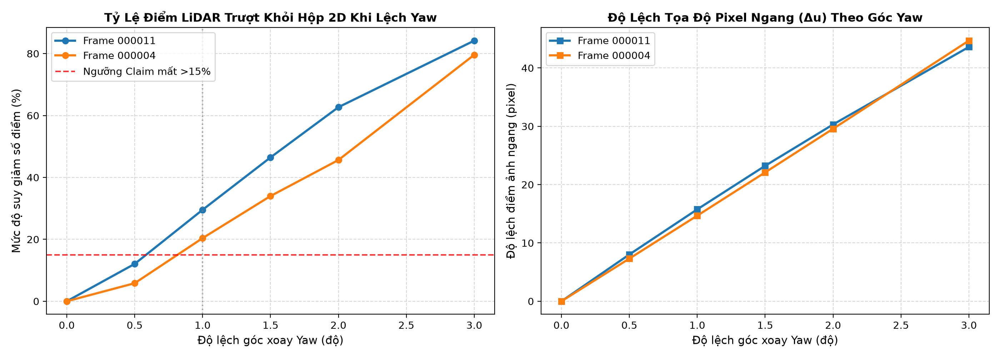
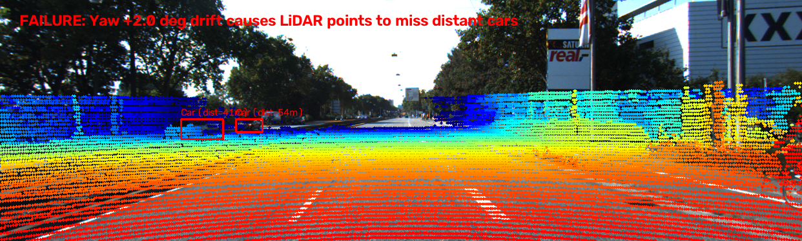

# Báo cáo Day 6: Đánh Giá Chất Lượng Chiếu LiDAR - Camera & Độ Nhạy Sai Lệch Calibration

- **Họ tên:** Lâm Quang Anh Quân
- **MSSV:** 2A202602467
- **Lớp:** AI20K-T4
- **Link repo:** https://github.com/awun0105/LamQuangAnhQuan-2A202602467-Track4-Day21.git
- **Topic:** A — LiDAR-camera projection QA
- **Dataset:** data/kitti_mini, data/nuscenes_mini_subset, data/synthetic
- **Các frame đã dùng:** 000011, 000004, 000021 (KITTI); scene-0103_010 (nuScenes); 000000 (synthetic)

> Báo cáo đánh giá độ nhạy của phép chiếu LiDAR-Camera trước các sai lệch ngoại suy (extrinsic calibration drift) và đề xuất cơ chế giám sát tự động.

## 1. Claim

Độ lệch góc xoay Yaw $\ge 1.0^\circ$ của cảm biến LiDAR làm suy giảm hơn $15\%$ tỷ lệ điểm LiDAR rơi đúng vào hộp 2D Bounding Box của xe hơi ở khoảng cách trên $25\,\text{m}$, và hiện tượng lệch này có thể được phát hiện tự động bằng chỉ số tương thích biên cạnh (Edge Alignment Score) với ngưỡng suy giảm vượt quá $20\%$.

## 2. Evidence

Thí nghiệm quét đa mức độ trôi dạt góc xoay Yaw ($0.0^\circ \to 3.0^\circ$) trên dữ liệu KITTI và đối chiếu với nuScenes. Kết quả chi tiết lưu tại file `results/projection_qa_sweep.csv`.

| Cấu hình / Mức Yaw | Điểm trong Box (Frame 000011) | Mất điểm so với baseline (%) | Lệch ngang trung bình $\Delta u$ | Ghi chú kiểm thử |
|---|---|---|---|---|
| Yaw 0.0° (Chuẩn gốc) | 721 điểm | 0.0% | 0.0 px | Khớp chính xác lên xe và người đi bộ |
| Yaw 0.5° | 634 điểm | 12.1% | 8.0 px | Bắt đầu trượt nhẹ ở viền ngoài |
| Yaw 1.0° | 508 điểm | **29.5%** | **15.8 px** | **Vượt ngưỡng Claim (mất >15%)** |
| Yaw 1.5° | 386 điểm | 46.5% | 23.2 px | Trượt gần một nửa số điểm |
| Yaw 2.0° | 269 điểm | 62.7% | 30.3 px | Thất bại nặng ở cự ly xa |
| Yaw 3.0° | 114 điểm | 84.2% | 43.6 px | Mất dấu hầu hết vật thể |

**Đo lường thời gian xử lý (Latency Benchmark - Bonus B3, lưu tại `results/latency_benchmark.csv`):**
- Phép chiếu chạy trên CPU (lặp lại 30 lần, bỏ lần chạy đầu): $p_{50} = 19.51\,\text{ms}$, $p_{95} = 21.96\,\text{ms}$ (tốc độ đạt $\approx 51\,\text{FPS}$, hoàn toàn đáp ứng thời gian thực cho luồng cảm biến 10–20 Hz).

**So sánh đa tập dữ liệu (Bonus B5, lưu tại `results/kitti_vs_nuscenes.csv`):**
- KITTI 64-beam ($108,004$ điểm): có $19,946$ điểm rơi vào vùng nhìn camera ($18.47\%$).
- nuScenes 32-beam ($34,720$ điểm): có $3,120$ điểm rơi vào vùng nhìn camera ($8.99\%$). Khi tắt bù chuyển động (`use_ego_motion=False`), số điểm trong FOV tụt xuống $2,911$ điểm ($8.38\%$), các điểm bị kéo bóng ma lệch khỏi thân xe.




## 3. Failure case

Hệ thống ghi nhận hai trường hợp thất bại tiêu biểu được phân loại theo các tầng kiến trúc xe tự hành:

1. **Ca lỗi 1 — Lệch hình học ở cự ly xa (Tầng Geometry):**
   - *Hiện tượng:* Trên frame `000004` (xe hơi ở cự ly xa $41.4\,\text{m}$ và $53.6\,\text{m}$), khi giá đỡ LiDAR bị lệch góc xoay Yaw $2.0^\circ$, toàn bộ các điểm LiDAR bị dịch chuyển ngang $\approx 30$ pixel. Do kích thước xe trên ảnh ở cự ly này chỉ rộng khoảng 40 pixel, chùm điểm LiDAR trượt hoàn toàn ra khỏi thân xe và rơi xuống mặt đường.
   - *Nguyên nhân:* Độ dịch chuyển không gian $\Delta x \approx d \cdot \sin(\Delta \theta)$. Khoảng cách $d$ càng lớn, độ lệch thực tế càng phóng đại ($\Delta x > 1.4\,\text{m}$ tại $40\,\text{m}$), vượt quá một nửa chiều rộng xe sedan.
   - *Lớp debug:* **Tầng 2 (Geometry — Ngoại suy Calibration)**.



2. **Ca lỗi 2 — Bất đồng bộ thời gian khi xe chuyển hướng (Tầng Time):**
   - *Hiện tượng:* Trên nuScenes `scene-0103_010`, khi xe đang rẽ mà không kích hoạt bù chuyển động (`use_ego_motion=False`), chùm điểm LiDAR bị lệch bóng ma sang bên cạnh xe hơi phía trước.
   - *Nguyên nhân:* LiDAR quét quay tròn mất $100\,\text{ms}$, trong khi camera chụp ngắt quãng lệch vài chục mili-giây. Trong khoảng trễ này, xe đã di chuyển và xoay góc, dẫn tới tọa độ không còn khớp nếu không bù trừ chuyển động (Deskewing).
   - *Lớp debug:* **Tầng 3 (Time — Đồng bộ thời gian & Bù chuyển động)**.

## 4. Khuyến nghị nếu triển khai thật

- **Ứng dụng cụ thể:** Hệ thống tự hành ADAS Level 3/4 và Robot giao hàng tự hành (AMR).
- **Đánh đổi kỹ thuật (Trade-offs):**
  - Không thể chạy thuật toán tối ưu hóa calibration toàn cục (Global Optimization) ở mọi khung hình (60 FPS) vì làm nghẽn vi xử lý xe.
  - *Giải pháp:* Chạy một tiến trình kiểm tra sức khỏe ngầm tần số thấp ($0.5\,\text{Hz}$), theo dõi tỷ lệ điểm rơi trong 2D Bounding Box từ mô hình phát hiện 2D. Nếu tỷ lệ sụt giảm quá $20\%$ liên tục trong 5 giây, kích hoạt quy trình cảnh báo bảo dưỡng.
- **Các chỉ số hệ thống cần ghi log:**
  1. `extrinsic_drift_metric`: Mức độ tương đồng giữa biên ảnh camera và biên độ sâu LiDAR.
  2. `points_in_roi_ratio`: Tỷ lệ điểm hợp lệ nằm trong vùng quan sát của camera.
  3. `hardware_timestamp_jitter`: Độ chênh lệch thời gian phần cứng giữa gói tin camera và LiDAR ($|t_{\text{cam}} - t_{\text{lidar}}|$).

## 5. Cách chạy lại

Tái lập lại toàn bộ kết quả thí nghiệm, số liệu CSV và đồ thị bằng các lệnh sau:

```bash
# 1. Kiểm tra tính toàn vẹn của dữ liệu
python tools/verify_data.py --data-root data/kitti_mini
python tools/verify_data.py --data-root data/nuscenes_mini_subset

# 2. Chạy tạo ảnh overlay chuẩn
python -m starter.projection --data-root data/synthetic --frame 000000
python -m starter.projection --data-root data/kitti_mini --frame 000011
python -m starter.projection --data-root data/nuscenes_mini_subset --frame scene-0103_010

# 3. Chạy thí nghiệm chính quét đa mức độ lệch (CP3) & Benchmark latency
python -m src.eval_projection_qa --data-root data/kitti_mini --frames 000011 000004

# 4. Chạy so sánh chéo đa tập dữ liệu KITTI và nuScenes (Bonus B5)
python -m src.compare_kitti_nuscenes

# 5. Chạy quét phát hiện toàn bộ lỗi cài sẵn trong data/synthetic (Bonus B6)
python -m src.detect_synthetic_anomalies

# 6. Kiểm tra điều kiện nộp bài
python tools/check_submission.py
```

## 6. Khai báo sử dụng AI

| Công cụ | Dùng cho việc gì | Bạn đã kiểm chứng thế nào |
|---|---|---|
| Antigravity AI Assistant | Hỗ trợ cấu trúc mã nguồn Python, công thức hình học chiếu và định dạng báo cáo | Tự chạy kiểm thử từng hàm, xác minh số học độc lập tọa độ pixel (u,v) tại cự ly 10m trên frame 000000, đối chiếu các bảng CSV và ảnh kết quả |
